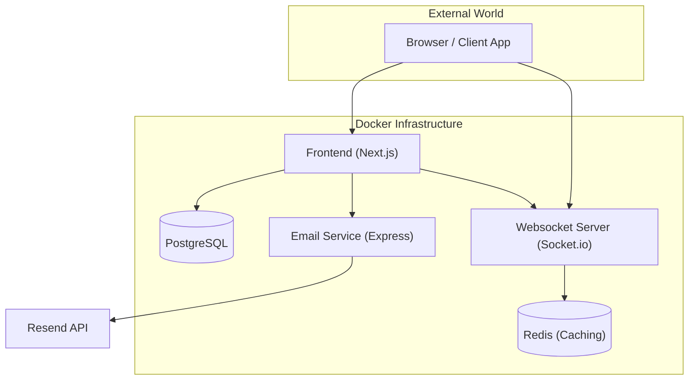

[](https://nextjs.org/)
[](https://react.dev/)
[](https://tailwindcss.com/)
[](https://www.postgresql.org/)
[](https://redis.io/)
[](https://www.docker.com/)

A robust, multi-service platform featuring a real-time messaging system, email OTP authentication, and a containerized infrastructure designed for reliability and scalability.

---

## Architecture Overview

The system is built using a modern microservices-inspired architecture, fully containerized with Docker. It ensures that all components—from the database to the real-time websocket server—are synchronized and healthy before use.

### System Diagram



---

## Services Breakdown

### Frontend Service (`frontend`)
The core user interface and server-side operations, powered by **Next.js**.
- **Tech Stack**: React 19, Next.js 16, Prisma ORM, Tailwind CSS.
- **Port**: `3000`
- **Health Check**: `http://localhost:3000/api/health`
- **Connections**: Connects to PostgreSQL for data, Email Service for OTPs, and Websocket for real-time updates.

### Email Service (`email-service`)
A lightweight Express-based microservice responsible for sending transactional emails (e.g., OTP codes).
- **Tech Stack**: Express, Node.js 20, Resend SDK.
- **Port**: `3002`
- **Health Check**: `http://localhost:3002/health`
- **Features**: REST API endpoint `/send-otp` for triggering email deliveries.

### Websocket Service (`websocket`)
Handles all real-time bidirectional communication, such as chat message relaying.
- **Tech Stack**: Node.js 22, Socket.io, `tsx`.
- **Port**: `3001`
- **Health Check**: `http://localhost:3001/health`
- **Role**: Relays events between connected clients in real-time rooms.

### Database (`db`)
Primary data storage for the entire platform.
- **Image**: `postgres:17-alpine`
- **Port**: `5432`
- **Health Check**: `pg_isready` check to ensure the DB is accepting connections before applications start.

### Caching (`redis`)
High-performance in-memory storage for session caching and shared state.
- **Image**: `redis:alpine`
- **Port**: `6379`
- **Health Check**: `redis-cli ping` check.

---

## Getting Started

### Prerequisites
- **Docker** and **Docker Compose** installed.
- **Resend API Key** (for email functionality).

### Local Deployment
To launch the entire stack with a single command:

```bash
docker compose up --build
```

This will automatically:
1.  Initialize the PostgreSQL database and Redis cache.
2.  Wait for the DB and Cache to be healthy.
3.  Build and start the Email and Websocket services.
4.  Build and start the Next.js Frontend once all dependencies are healthy.

---

## Environment Configuration

The project uses two primary `.env` files to manage secrets and connection strings.

### Root `.env`
Located at `/`, used by Docker Compose for service-wide secrets.
| Variable | Description | Example |
| :--- | :--- | :--- |
| `RESEND_API_KEY` | Your API key from Resend.com | `re_...` |
| `EMAIL_FROM` | The sender email address | `support@one-to-one.polizhai.site` |

### Frontend `.env`
Located at `/services/frontend/.env`, used by Next.js and Prisma.
| Variable | Description | Default (Docker) |
| :--- | :--- | :--- |
| `DATABASE_URL` | PostgreSQL connection string | `postgresql://postgres:password@db:5432/one_to_one` |
| `EMAIL_SERVICE_URL` | URL for the internal email API | `http://email-service:3002` |
| `REDIS_URL` | Redis connection string | `redis://redis:6379` |
| `NEXT_PUBLIC_APP_URL` | Public URL of the frontend | `http://localhost:3000` |
| `NEXT_PUBLIC_SOCKET_URL` | Public URL for Socket.io | `http://localhost:3001` |

---

## Health & Reliability System

We have implemented a sophisticated **Health Check** mechanism to ensure zero-downtime starts and dependency synchronization.

1.  **Introspection**: Every service has a dedicated `/health` endpoint or command-line check.
2.  **Wait-Until-Healthy**: The `frontend` service is configured with `depends_on: { condition: service_healthy }`. It will **not** start until the database, cache, and email systems are fully verified.
3.  **Curl-Powered**: We've customized the Alpine-based Docker images to include `curl`, allowing the internal Docker daemon to poll the application status natively.

---

## Project Structure

```text
├── services/
│   ├── frontend/         # Next.js App, Prisma schema, Websocket code
│   │   ├── Dockerfile    # Main Frontend build
│   │   ├── Dockerfile.socket # Websocket-specific build
│   │   └── src/          # Source code
│   └── email/            # Express Email microservice
│       ├── Dockerfile    # Email service build
│       └── src/          # Source code
├── docker-compose.yml    # Root orchestration file
└── README.md             # This comprehensive documentation
```

---

## Troubleshooting

### Resetting the Environment
If you need a clean slate (deleting the database data and starting fresh):
```bash
docker compose down -v
docker compose up --build
```
